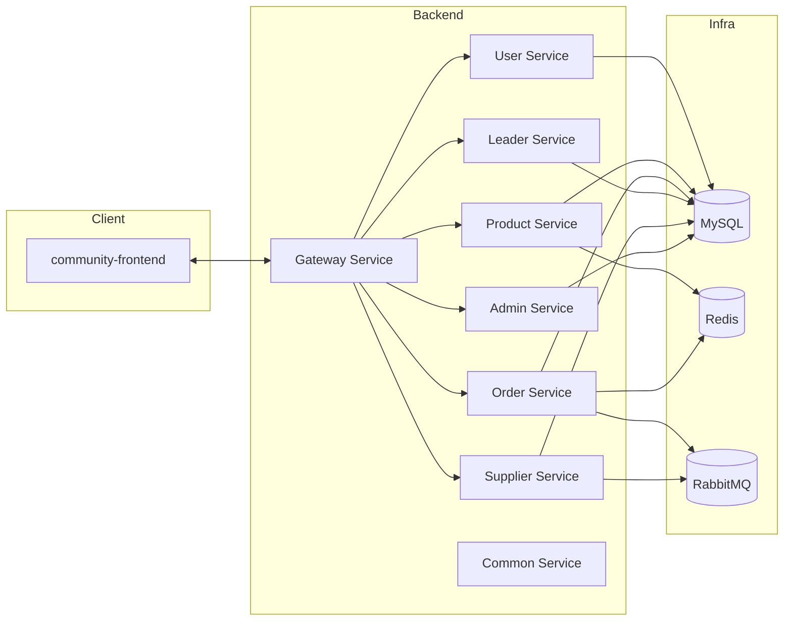

# 社区团购系统

> 多角色协同的社区团购平台，覆盖居民下单、团长履约、供应商供货与平台治理的全链路场景。

## 项目背景
- 面向社区居民，希望通过线上渠道购买日常用品并由熟悉的团长统一收货/自提。
- 团长负责社区管理、订单统计与履约协调，需要即看即用的任务面板。
- 供应商希望一套自助入驻 + 商品上架流程，能感知订单状态并及时发货。
- 平台方负责审核、数据分析、库存风控等运营动作。

## 仓库结构
| 路径 | 说明 |
| --- | --- |
| `community-backend/` | Spring Boot + Spring Cloud 多模块后端（用户、商品、订单、团长、供应商、管理后台、网关、公共模块），详见该目录下新的 `README.md`。 |
| `community-frontend/` | Vue 3 + Vite + Pinia + Element Plus 的多角色前端，详见该目录下新的 `README.md`。 |
| `init.sql` | 数据库初始化脚本，已合并 `community-backend/database/schema.sql` 与 `data.sql`，一次执行即可完成建表与演示数据导入。 |
| `docker-compose.yml` | 快速启动 Redis、RabbitMQ、Adminer（可视化管理 MySQL）的最小依赖。 |
| `postman_collection.json` | 通过网关访问的核心 API Postman 集合副本，便于直接导入调试（原始文件位于 `community-backend/docs/postman/`）。 |
| `docs/api/openapi.yaml` | 精简 OpenAPI 3.0 规范，覆盖登录、商品、购物车、订单、统计等关键接口。 |
| `start.cmd` | Windows 快捷启动脚本，可串联常用服务。 |
| `docs/delivery-checklist.md` | 「四步提交流程」的执行记录。 |

## 一键启动 / 快速体验
1. 在仓库根目录执行 `docker-compose up -d`，一次拉起 MySQL 依赖（Adminer 可选，用于可视化管理）。
2. 运行 `init.sql`（或分别执行 `community-backend/database/schema.sql` + `data.sql`）初始化数据库。
3. 进入 `community-backend` 执行 `./mvnw spring-boot:run -pl gateway-service -am`，即可将各后端模块连同网关拉起。
4. 进入 `community-frontend` 执行 `npm install && npm run dev`，通过 `http://localhost:5173` 访问前端，默认代理网关 `http://localhost:8080`。
5. 调试 API 时，可打开 `http://localhost:8080/swagger-ui/index.html` 查看聚合文档，或导入 `postman_collection.json` 直接调用。

## 架构图

## API 文档
- **运行态 Swagger UI**：各微服务暴露 `http://localhost:<port>/swagger-ui/index.html`（交互 UI）与 `http://localhost:<port>/v3/api-docs`（JSON/YAML 规格）。网关聚合入口 `http://localhost:8080/swagger-ui/index.html` 可在单页切换 user/product/order/leader/supplier/admin 六个服务的 OpenAPI。
- **静态托管**：`docs/api/openapi.yaml` + `docs/api/swagger.html`。将 GitHub Pages 指向 `/docs` 后，即可在 `https://<your-account>.github.io/Community/api/swagger.html` 对外展示；本地可 `npx serve docs/api` 预览。
- **官方参考**：项目使用 [springdoc-openapi](https://springdoc.org/)（OpenAPI 3 Library for Spring Boot），更多配置示例见其 [GitHub 仓库](https://github.com/springdoc/springdoc-openapi)。

## 功能点
- **用户模块**：注册/登录、个人信息维护、地址管理与默认地址缓存（Redis），JWT 单点登录 + RBAC 权限校验。
- **团长模块**：团长申请与审批、社区档案、地理位置匹配、订单统计、团长看板。
- **商品模块**：分类管理、全量/全文搜索、供应商上架、审核流、Redis + Lua 的秒级库存预占与同步。
- **购物&订单**：Redis 购物车、下单 → 预占库存 → 支付 → 发货 → 收货的分阶段流程，RabbitMQ 延迟队列自动关单，Outbox 事件保证幂等通知。
- **供应商模块**：入驻审核、商品管理、待发货订单、物流回传，与订单服务通过 RestClient 解耦。
- **管理后台**：角色审批、商品审核、全局指标、事件消费日志，可聚合下游接口或直接走网关。
- **配套服务**：地理编码（高德开放平台，`AMAP_KEY`），网关统一鉴权 & TraceId 透传，公共组件提供 `ApiResponse`、`SimpleMetrics`、`RedisCircuitBreaker`、`@RequiresPermissions` 切面等。

## 技术栈
### 后端
- Spring Boot 3.4、Spring Cloud 2024.0、Spring Security、Spring Cloud Gateway
- MyBatis-Plus、MySQL 8、Redis 7、RabbitMQ、RestClient
- JWT、Method Security、分布式事务（Outbox + 事件总线）

### 前端
- Vue 3、Vite 5、Vue Router 4、Pinia、Element Plus、Axios
- 统一 `http` 拦截器、按需组件自动导入、角色路由守卫、可配置支持/客服链接

### 基础设施
- MySQL（外部安装或云服务）
- Redis（会话/缓存/库存/默认地址）
- RabbitMQ（订单延迟关闭与事件总线）
- Adminer（或其它客户端）+ Docker Compose 辅助开发

## 运行快速指引
1. **准备依赖**：JDK 21、Node.js 18+、Maven 3.9+、npm/pnpm、Docker（可选）。
2. **启动基础设施**（可选）：在仓库根目录执行 `docker-compose up -d`，获得 Redis、RabbitMQ、Adminer。
3. **导入数据库**：将 `init.sql` 导入 MySQL，并创建与 `application.yml` 一致的账号/密码。
4. **配置环境变量**（示例）：
   - `MYSQL_HOST`, `MYSQL_PORT`, `MYSQL_USER`, `MYSQL_PASSWORD`
   - `REDIS_HOST`, `RABBITMQ_HOST`
   - `JWT_SECRET`（可选，未配置使用默认值）
   - `AMAP_KEY`（启用地理编码必配）
5. **启动后端微服务**：进入 `community-backend` 执行 `./mvnw spring-boot:run -pl gateway-service` 等命令，或通过 IDE/多终端分别运行各服务（默认端口见下）。
6. **启动前端**：进入 `community-frontend`，执行 `npm install`、`npm run dev`（默认 5173 端口，对应 Vite 代理 `/api` → 各微服务或网关）。
7. **访问方式**：前端通过 `VITE_GATEWAY`/`VITE_API_PREFIX` 指向网关（8080）或代理；也可以直接访问各后端服务开放的 Swagger UI (`/swagger-ui.html`) 调试。

## 服务端口 & 依赖
| 服务 | 端口 | 关键能力 |
| --- | --- | --- |
| Gateway | `8080` | 路由拆分、CORS、TraceId、统一入口 |
| User Service | `8081` | 注册登录、地址、RBAC、地理编码 |
| Product Service | `8082` | 分类、搜索、库存、供应商商品 |
| Order Service | `8083` | 购物车、下单、延迟关单、发货/收货、统计、Outbox |
| Leader Service | `8084` | 团长申请、社区数据、地理推荐 |
| Supplier Service | `8085` | 入驻审核、订单发货、跨服务调用 |
| Admin Service | `8086` | 聚合审批、全局指标、事件消费日志 |
| Redis / RabbitMQ | `6379` / `5672` | 缓存、库存、消息队列 |

> 如需注册中心，可参考 `discovery-yml/` 配置并开启 `DISCOVERY_ENABLED=true`。

## 业务流程速览
1. **用户注册/登录** → 获取 JWT，Pinia 保存并通过 Gateway 透传至后端。
2. **选品到下单** → 前端调用 `/products` & `/cart` → Order Service 校验商品并通过 Product Service 预占 Redis 库存。
3. **支付 → 发货** → 成功支付触发 `OrderEventPublisher` 推送 `order.paid`，Supplier Service/后台可订阅；供应商通过 `/shipping` 发货，写入 `ShipmentEvent`。
4. **延迟关单** → RabbitMQ 延迟队列监听 15 分钟未支付订单，自动取消并回补库存。
5. **收货 & 评价** → 用户确认收货切换状态，Leader/Supplier/管理员通过自身面板查看统计与 KPI。
6. **运营分析** → Admin Service 将订单服务统计接口聚合，或通过事件总线获取实时指标。

## 技术难点与解决方案
- **多角色权限**：JWT + Spring Security 角色校验 + 自定义 `@RequiresPermissions` 切面，结合 User Service 暴露的 RBAC 校验接口。
- **库存实时同步**：Product Service 使用 Redis + Lua 保证预占库存原子性，支持释放/DB 同步接口。
- **订单分阶段处理**：Order Service 将状态拆成 `CREATED → PAID → SHIPPED → DELIVERED`，通过延迟队列、事件总线、ShipmentEvent、发票/备注接口实现全流程。
- **地理推荐**：Leader Service 基于社区纬经度与简单 Haversine 计算返回附近站点；User Service 通过 `AMAP_KEY` 对接高德正逆地理编码。

## 深入阅读
- `community-backend/README.md`：微服务模块、表结构、调用链、调试方式的详细说明。
- `community-frontend/README.md`：页面结构、状态流、API 约定、无障碍与可配置项。
- `docs/delivery-checklist.md`：四步提交流程的执行记录（当前已落实 Step 1：GitHub 仓库链接）。

如需扩展或上线，请先阅读上述子 README，以便了解环境变量、测试策略与部署建议。
